## Hours Spent:
50+

## Introduction:
In this lab, required to design and build a digital interface on an FPGA to read input from a 4×4 matrix keypad and display the results on a dual seven-segment display. Here it was vital that the circuit must correctly detect and register each key press exactly once, regardless of how long the key is held, while also ignoring additional simultaneous key presses. Here, the two most recent hexadecimal digits entered would appear on the display, with the newest value shown on the right (previous on the left). The display needed to maintain a consistent brightness and flicker-free operation. 

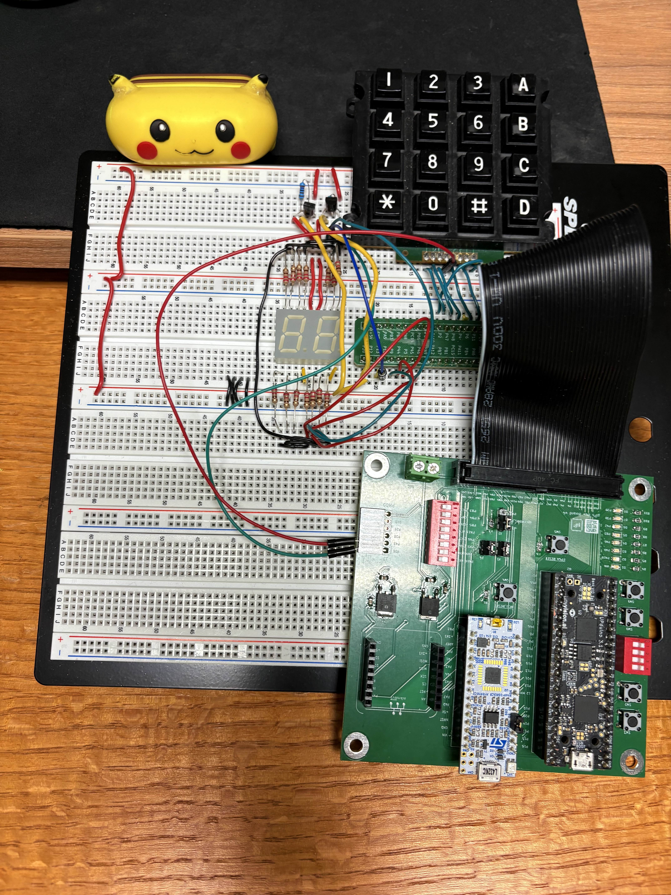

### High Frequency Clock
To do this first required to parameterize and set up signal declarations a function was defined to initialize a 48 MHz clock period (20.83) ns here the The freqGen module generates a lower-frequency clock signal from a higher-frequency input clock by using a counter to divide the input frequency. It toggles the output desiredFreqOut high or low based on the counter, 	producing a square wave at approximately half the period of the division factor. The module also supports a synchronous reset to restart the counting process.

## Driving the Segment Display 
With a working global clock, values were passed into a multiplexer which drives segment display by rapidly multiplexing the left and right digits using the fast int_osc clock. Here the multiplexer module multiplexes a two-digit seven-segment display by rapidly toggling between the left and right digits. It alternately selects and displays the upper or lower 4 bits of an 8-bit input value at a frequency determined by a divider, creating the illusion that both digits are lit simultaneously. The outputs swL and swR control which display is active, while seg drives the segment lines. 

### The FSM
Next values were placed into a finite state machine which scans a 4x4 keypad by sequentially activating each column (sweep) and monitoring the row inputs (rowDataIn) to detect a key press. When a button is pressed and verified, it decodes the corresponding key value and updates the two-digit display, shifting the previous key to the left and showing the new one on the right. The FSM also holds the display until no key is pressed, ensuring stable and debounced input. This FSM has three helper functions or submodules which deBounce the press, decode the button press, and hold the keypress. 

Looking at the deBouncer, its logic functions as a stability or debounce counter that verifies when a keypad input remains consistent for a set duration. It increments a counter while the current input (rowDataIn) matches the stored value (holdRow) and decrements when they differ, filtering out noise or brief changes. Once the signal stays stable long enough, it asserts high to confirm a valid press and low when the key is released.

Looking at the keypad decoder, its goal is to decode the pressed key from a 4x4 matrix keypad by identifying which column (holdSweep) and row (holdRow) lines are active. It maps the detected rows and column combination to a corresponding 4-bit hexadecimal value that represents the keypads identity. The resulting decodedKey output provides a digital code used for display or further processing in the system.

The last submodule monitors keypad inputs and ensures that no key has been pressed for a certain duration before signaling completion. It increments a counter when any key is pressed and decrements it when all keys are released, asserting the holdLow output once the counter reaches zero. This mechanism prevents accidental or repeated key presses by confirming that the keypad has been idle for the required time.

### Synchronizing the asynchronous row inputs
Finally, the last phase is to ensure that only a single press was detected. This is where the ensureSinglePress module comes it to play where it reads the raw 4-bit row inputs from  a keypad, converts them into a single-hot, active-high representation, and synchronizes the result to the system clock to avoid metastability. It ensures that only valid single-key presses are captured while filtering out multiple simultaneous presses. The synchronized output rowDataIn provides a stable and safe signal for downstream modules like key decoders or FSMs.

## Technical Documentation:
The source code for this project can be found in the associated Github repository here: [GitHub_Lab2_CH](https://github.com/Cameron-Hernandez-HM/E155/tree/main/Lab3_CH)

## Block Diagram:
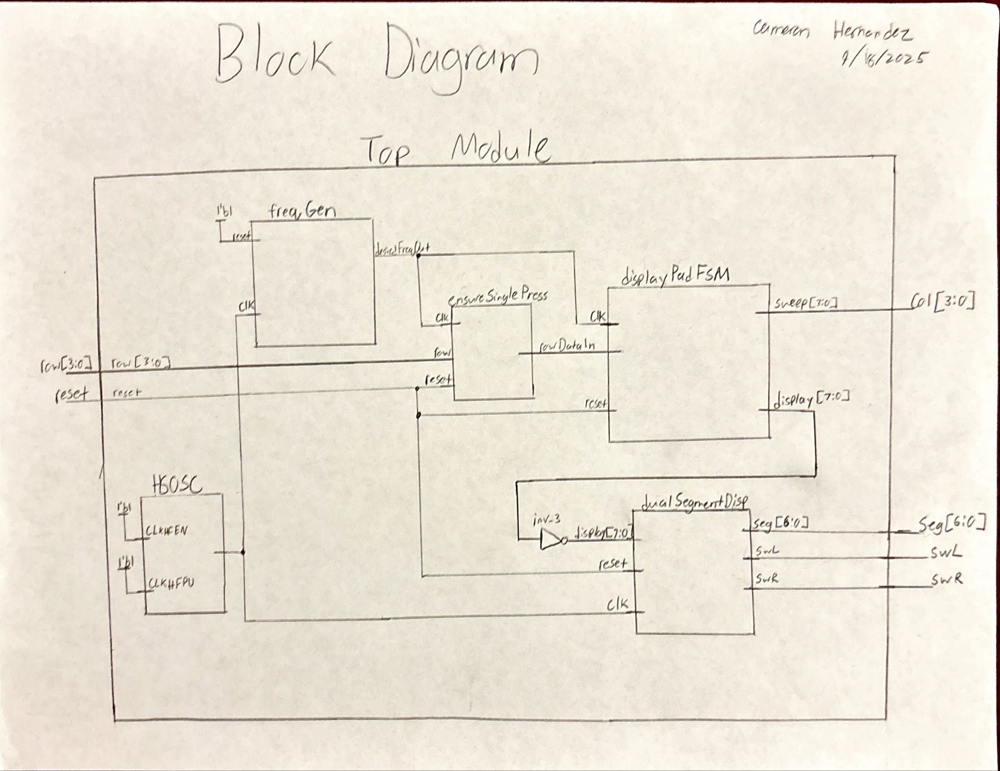

Figure 2 illustrates a block diagram of the architecture of the design for lab 2. The top module takes in the inputs for the two 4-bit DIP Switches. Here they go into a mode which selects which dipswitch will output to the segment display module which controls the outputs of the leds on the segment display. This mux is governed by the bit value ledState which flips every 60Hz as instructed by the clkWorld module which accepts a high speed oscillation clock. Furthermore, ledState is what determines which enable will be activated. 

Going back to the DIP switches, their logic is also passed into an adder block which combines the binary values of the switches into a 5 bit value. This is then negated as we are in active low. Lastly, leaving the segmentDisplay module we have our seven bit value seg which is what determines which led lights will be activated on the segment display. 

## Schematic:
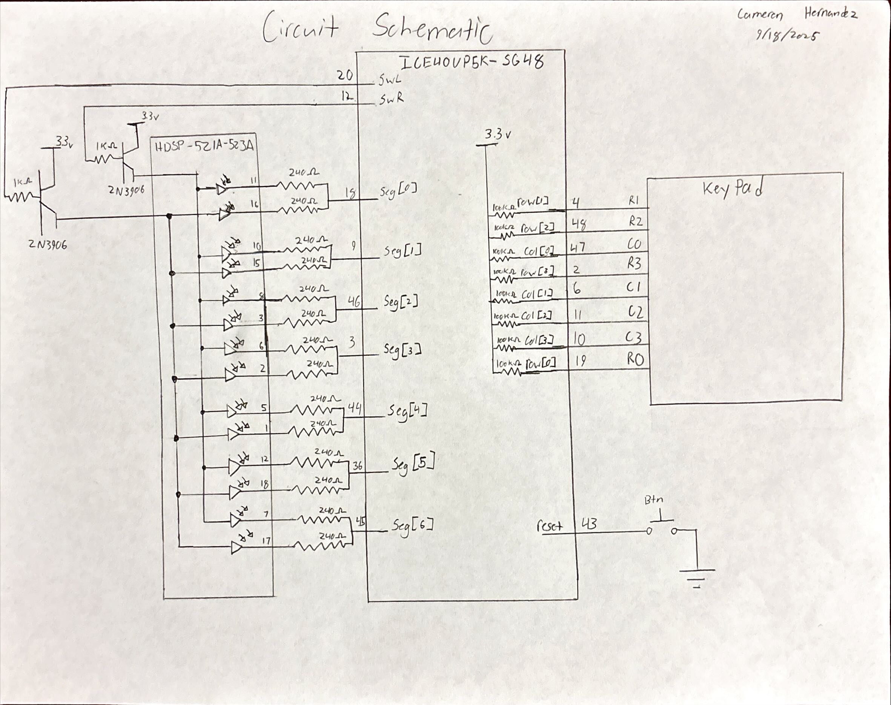

Figure 3 illustrates a the schematic of the system where two sets of four switches which connect into the FPGA block ICE40UP5K-S648. Each switch connects to a corresponding pin where there is a 100KΩ internal resistor that then connects to the 3.3V supply. Output from the FPGA pins, specifically pins 10, 42, 19, 11 and 38 connect to an 5 leds which each have a 1kΩ pull down resistor. A 3.3V from the FPGA powers the HD5P-521A-523A seven segment display which internally has 14 leds. These leds first connect to a 240Ω resistor to allow for a minimal current to enter the FPGA as well as allowing for a bright display. These pins are then shorted to their corresponding match and then inputed into the FPGA

## FSM State Transitions
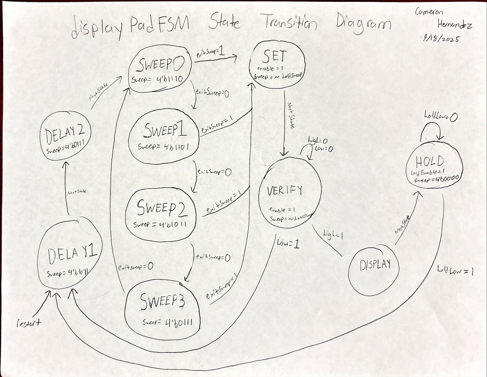

Figure 4 illustrates the FSM transition diagram illustrating an intial first two delay states following into a sweep system which sweeps through the different possbile columns corresponding to a column button press on the keypad. Breaking out of the sweep states only when exitSweep goes high the values then get set and then pushed to verrified which ensures no misproper reading is going on. Lastly assuming a rail is high or low, the display outputs the values and then holds them in the hold state. 

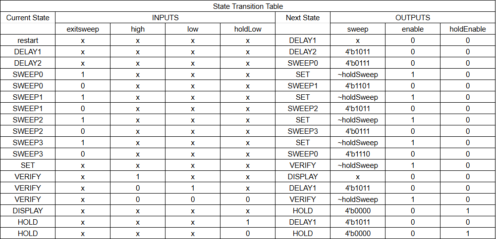

Figure 5 illustrates the inputs and outputs of each state as well as the current state and next state. 

## Simulation:
Here is where my test benches reside for my various modules:

### keypadDecoder
To ensure that the key pad reads the correct values based on the keypadDecoder function, the test bench serverd to "sweep" across the different colums and simulate pressing every button and seing their value. Starting with column zero, the buttons that reside are 1, 4, 7, and E. These values are exactly what is displayed in the testbench. The testbench then illustrates the values of all the other buttons in the other columns. 
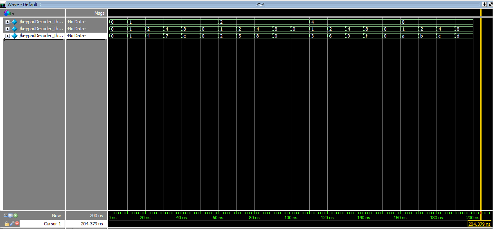

### deBounce
To test and ensure that debounce was working correclty, I first verrified that the top and bottom rails worked corerclty which can be seen when counter hits the hexidecimal value "a" we see high go well high, and when counter hits "0" we see low go low. Speaking of counter, we also see that counter is opperating corerctly basied on how the testbench was defined (Increases when rowDataIn == Hold row [0100] and decreases when rowDataIn != holdRow [0010]). Futhermore we see that rowDataIn and holdRow are correct as they start at 4'b1111 (no key pressed) then go to 0100 (key press) briefly to 0010 (noise) back to 0100 (stable press again) then finally return to 1111 (key release)
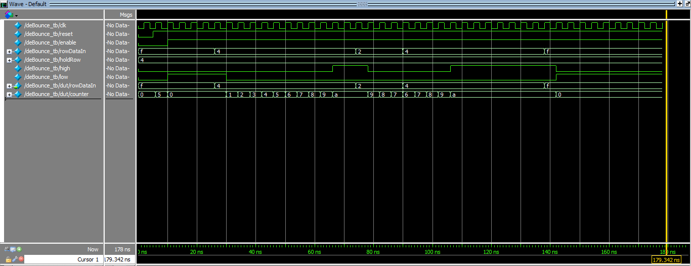

### segmentDisplay
From last lab I had already written a test bench for this module, it still works.
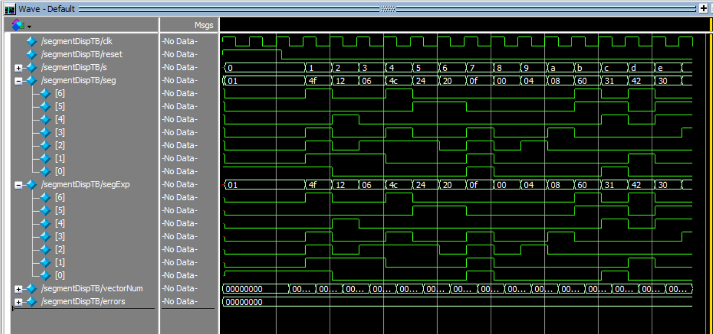

### holdKey
In simulation, the holdKey module behaves as expected: when holdEnable is low, the counter stays at its midpoint value. Once enabled, pressing any key (rowDataIn != 0) causes the counter to increment toward its maximum, while releasing the key (rowDataIn = 0) makes it count down. After remaining idle long enough for the counter to reach zero, the output holdLow asserts high, signaling that the keypad has been released and is stable.
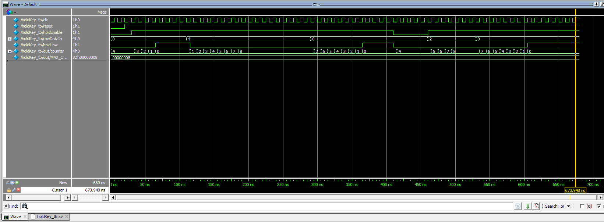

### FSM
The waveform confirms that the testbench and FSM are functioning as intended. After reset is released, the FSM progresses through its initialization states DELAY1 -> DELAY2 -> SWEEP0–SWEEP3, sequentially driving the sweep outputs while monitoring rowDataIn. When a key press is simulated (rowDataIn = 4’b0010), the FSM transitions to SET and then VERIFY, where the testbench forces the high signal to simulate a valid debounced input. This causes the FSM to move into the DISPLAY state, where the decoded key value is stored and shown on the display output. The FSM then enters HOLD, during which holdEnable remains high and the display is latched. Finally, when the testbench forces holdLow, the FSM returns to DELAY1, completing a full key press cycle. The signal transitions in the waveform—particularly the alignment of enable, holdEnable, high, and state changes—demonstrate correct timing and sequencing between the testbench stimuli and the FSM’s internal behavior.

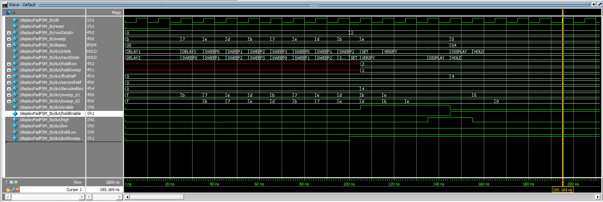

Furthermore, during the DISPLAY and HOLD states, the FSM updates the seven-segment display outputs to reflect the pressed key. The decodedKey signal captures the binary code corresponding to the active rowDataIn pattern, while firstHalf and secondHalf represent the upper and lower digits of the display pad. When the FSM transitions into DISPLAY, these outputs are driven to show the current key value, with display combining them for visual output. In HOLD, the holdEnable signal freezes these outputs so the same value remains visible even as the sweep lines (sweep[3:0]) continue cycling internally. When holdLow is asserted, the FSM resets the display update logic, clearing decodedKey and re-enabling scanning. This confirms that the design correctly latches, displays, and clears key data across full FSM cycles, as verified by the stable plateaus and synchronized transitions in the waveform.

### ensureSinglePress
This module's main goal is to read the raw 4-bit row inputs from a keypad and convert them into a single-hot, active-high representation. As it makes sense that when row is f or 4'b1111, the output rowDataIn is 0 or 4'b0000. Furthermore we see that synchrinization when row changes or updates the changes propagate illustrating a two-stage synchronizer.
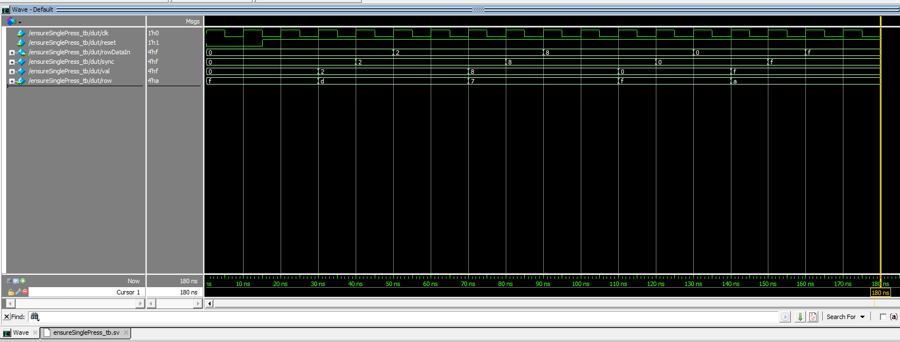

### Top
Lastly, here is a simluated top module with all of the working submodules in play. 
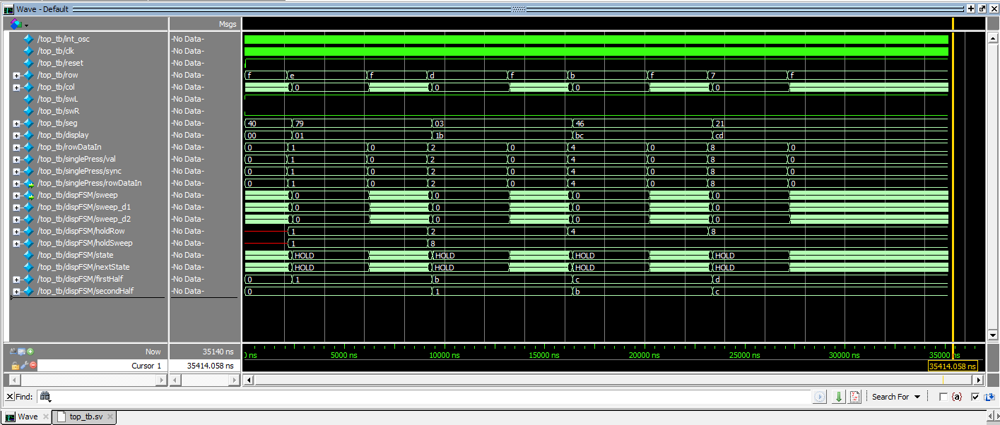

The simulation waveform confirms that the overall design is functioning correctly. The internal oscillator and clock signals are toggling consistently, ensuring proper timing for all sequential elements. The row input signals cycle through valid keypad patterns, and the synchronized rowDataIn output from the pin reader accurately follows these transitions, demonstrating correct debouncing and synchronization behavior. The column outputs (col) sweep through the expected sequence as the scanning FSM iterates through each column, while the FSM’s state transitions between scanning and hold phases in response to detected key presses. During each HOLD state, the decoded key value is correctly latched into the display output (display), which updates the seven-segment driver signals (seg, swL, and swR) accordingly. The displayed hexadecimal values change in correspondence with each simulated key press, confirming proper operation of the key detection, decoding, and display update processes. Overall, the waveform behavior verifies that the integrated system — including the scanning FSM, synchronization logic, and display multiplexer — performs as intended.

## Results:
The design met all the intended design objectives. This lab took me a really long time, but I am glad to see that everything here works correctly. I feel however that my keypad itself is just old and a bit buggy, because I experence issues only sometimes with the button press 6 and only that button. Its a bit strange but other than that everything works, now I wanted to talk about why I used the deBouncing. 

The system employs a dual-clock architecture and a layered input processing approach to achieve a highly reliable and user-friendly experience. The first major tradeoff involves clock management: dedicating the high-frequency 48 MHz internal oscillator (int_osc) solely to the display multiplexer provides a visibly flicker-free and smooth display. The tradeoff here is accepting the complexity of having a bulky 32-bit frequency divider (freqGen) and its latency to generate a secondary, slow 1 kHz clock (clk). This slow clock is crucial because it allows the Finite State Machine (FSM) to use simple, small counters (e.g 42 counts for 42 ms) to accurately measure real-world time for debouncing, which is far simpler and more resource-efficient than trying to manage millisecond-level timings on the 48 MHz clock.

The second critical set of tradeoffs centers on input robustness. To handle the noisy, asynchronous nature of a mechanical keypad, the design prioritizes stability. The ensureSinglePress module enforces two constraints: metastability avoidance via a 2-flip-flop synchronizer (at the cost of two clock cycles of latency) and the crucial rejection of multi-key presses, ensuring the FSM only processes one clean, active-high key input. This synchronized, validated signal is then passed to a voter-based debouncer (deBounce): an up/down counter that only increments when the input is stable and decrements when it is noisy. This method is highly resilient to transient noise compared to a simpler, time-out-and-reset counter, which would require the user to hold the key perfectly still for the entire debounce duration every time.

## AI Prototype:

For the first prompt I asked ChatGPT to Write synthesizable SystemVerilog to scan a 4x4 matrix keypad and display the last two hex keys pressed on a dual 7‑segment display. Implement:
A clock divider that derives a scan clock on the order of 100–200 Hz from the internal oscillator.
A keypad scanning controller that iterates one active‑low column at a time and samples active‑low rows, registering at most one key per press (debounce‑by‑design), ignoring additional presses while any key is held, and allowing a new registration only after release.
A top level that updates two hex digits (older and most recent) when a new key is registered and drives a time‑multiplexed two‑digit 7‑segment display without visible flicker and with balanced brightness.
Use idiomatic SystemVerilog (e.g., logic, always_ff, enumerated states for FSMs). Provide clean module boundaries and keep all state synchronous. Include brief comments explaining the design choices.

Given a Target device: Lattice iCE40 UP5K FPGA with internal high-speed oscillator (~20 MHz).

Here ChatGPT gave me this:

Nice — here’s a clean, synthesizable SystemVerilog solution for the Lattice iCE40-UP5K.
Design summary (high level):

clk_divider — generic synchronous divider that produces a single-cycle pulse at a requested output frequency (use it to create slow keypad scan ticks and a faster display multiplex tick).

keypad_scanner — scans 4 columns (one active-low at a time) and samples 4 active-low rows. It registers at most one key per press, ignores further presses while any key is held, and only re-enables registration after a configured number of release-stable scans (simple release debounce).

hex7seg — converts 4-bit hex nibble to 7-segment pattern (parameterizable segment polarity).

top_keypad_7seg — top module wiring everything: keeps the last two hex keys (older, most recent) and time-multiplexes the two digits at a high rate so there is no flicker and brightness is balanced.

All state is synchronous and FSMs use enumerated states. Comments explain the choices and parameters.

You can paste this into your project and change parameters (input clock frequency, desired scan/display rates, active polarities, or keypad mapping) as needed.

// File: keypad_7seg_top.sv
// Target: Lattice iCE40 UP5K (internal oscillator ~20 MHz)
// Author: ChatGPT (Caveat: adjust pin polarity to your board's wiring)

`default_nettype none

// -----------------------------------------------------------------------------
// Generic clock divider that produces a 1-cycle pulse at 'OUT_HZ'.
// Synchronous, parameterizable.
// -----------------------------------------------------------------------------
module clk_divider #(
    parameter int IN_HZ  = 20_000_000,   // input clock frequency (Hz)
    parameter int OUT_HZ = 125          // desired output pulses per second
) (
    input  logic clk,
    input  logic rst_n,                 // active-low synchronous reset
    output logic tick                   // one-clock-cycle pulse at OUT_HZ
);
    // Number of clocks per output period
    localparam int COUNT = IN_HZ / OUT_HZ;
    // counter width
    localparam int W = $clog2(COUNT + 1);

    logic [W-1:0] ctr;

    always_ff @(posedge clk) begin
        if (!rst_n) begin
            ctr  <= '0;
            tick <= 1'b0;
        end else begin
            if (ctr == COUNT - 1) begin
                ctr  <= '0;
                tick <= 1'b1;
            end else begin
                ctr  <= ctr + 1;
                tick <= 1'b0;
            end
        end
    end
endmodule

// -----------------------------------------------------------------------------
// Keypad scanner for 4x4 matrix.
// - columns are driven active-low (only one column active at a time).
// - rows are sampled and are active-low when a key connects them to the active column.
// - On the first detection of a pressed key (row low while scanning a column) it
//   outputs a single-cycle new_key pulse and the 4-bit key code.
// - While any key remains held, no further keys are reported.
// - After all keys released for RELEASE_STABLE consecutive scan cycles, it
//   re-enables detection (simple release debounce).
// -----------------------------------------------------------------------------
module keypad_scanner #(
    parameter int RELEASE_STABLE = 3   // consecutive scan cycles of 'no key' needed to clear hold
) (
    input  logic        clk,           // system clock (synchronous)
    input  logic        rst_n,
    input  logic        scan_tick,     // slower tick used to advance scanning (e.g., 100-200 Hz)
    input  logic [3:0]  rows,          // active-low inputs from keypad rows (external pull-ups expected)
    output logic [3:0]  cols_n,        // outputs to keypad columns (active-low one-hot)
    output logic        new_key,       // 1-cycle pulse when a new key is registered
    output logic [3:0]  key_code       // 4-bit code for key (user-defined mapping)
);
    // Scanner states
    typedef enum logic [1:0] {S_SCAN, S_HELD} state_t;
    state_t state;

    // scanning column index 0..3
    logic [1:0] col_idx;

    // hold flag indicates we've already registered a key and are waiting for release
    logic hold;

    // stable release counter
    int release_cnt;

    // local outputs
    logic [3:0] cols_n_r;
    logic new_key_r;
    logic [3:0] key_code_r;

    // key mapping:
    // We'll map (row, col) -> 4'h0 .. 4'hF. Adjust mapping to taste.
    // Format: row0..row3 (top..bottom), col0..col3 (left..right)
    // Mapping chosen (common keypad-like layout but hex):
    // [ r0c0 r0c1 r0c2 r0c3 ] = 1,2,3,A
    // [ r1c0 r1c1 r1c2 r1c3 ] = 4,5,6,B
    // [ r2c0 r2c1 r2c2 r2c3 ] = 7,8,9,C
    // [ r3c0 r3c1 r3c2 r3c3 ] = E,0,F,D
    function automatic logic [3:0] map_key(input int r, input int c);
        case ({r,c})
            6'd0: map_key = 4'h1; // r0 c0
            6'd1: map_key = 4'h2; // r0 c1
            6'd2: map_key = 4'h3; // r0 c2
            6'd3: map_key = 4'hA; // r0 c3

            6'd4: map_key = 4'h4; // r1 c0
            6'd5: map_key = 4'h5; // r1 c1
            6'd6: map_key = 4'h6; // r1 c2
            6'd7: map_key = 4'hB; // r1 c3

            6'd8: map_key = 4'h7; // r2 c0
            6'd9: map_key = 4'h8; // r2 c1
            6'd10: map_key = 4'h9; // r2 c2
            6'd11: map_key = 4'hC; // r2 c3

            6'd12: map_key = 4'hE; // r3 c0 ('*' mapped to E)
            6'd13: map_key = 4'h0; // r3 c1
            6'd14: map_key = 4'hF; // r3 c2 ('#' mapped to F)
            6'd15: map_key = 4'hD; // r3 c3
            default: map_key = 4'h0;
        endcase
    endfunction

    // Drive columns: active-low one-hot; only one column asserted per scan step.
    always_comb begin
        cols_n_r = 4'b1111;
        cols_n_r[col_idx] = 1'b0; // make selected column low (active)
    end

    // scanning and detection: advance col_idx on each scan_tick
    always_ff @(posedge clk) begin
        if (!rst_n) begin
            col_idx      <= 2'd0;
            state        <= S_SCAN;
            hold         <= 1'b0;
            release_cnt  <= 0;
            new_key_r    <= 1'b0;
            key_code_r   <= 4'h0;
        end else begin
            new_key_r <= 1'b0; // default, a one-cycle pulse when we detect new key

            if (scan_tick) begin
                // Rotate to next column each scan tick
                col_idx <= col_idx + 1;

                // sample rows for current active column (rows are active-low)
                // If any row is low, record its index (first/lowest index)
                logic found;
                int r_idx;
                found = 1'b0;
                r_idx = -1;
                for (int r = 0; r < 4; r++) begin
                    if (rows[r] == 1'b0 && !found) begin
                        found = 1'b1;
                        r_idx = r;
                    end
                end

                case (state)
                    S_SCAN: begin
                        if (found && !hold) begin
                            // Register the first detected key (row r_idx at current col_idx)
                            hold       <= 1'b1;
                            key_code_r <= map_key(r_idx, col_idx);
                            new_key_r  <= 1'b1;
                            // enter HELD state to wait for release
                            state      <= S_HELD;
                            release_cnt <= 0;
                        end
                    end

                    S_HELD: begin
                        if (!found) begin
                            // no key seen in this scan step: increment release counter
                            if (release_cnt < RELEASE_STABLE) release_cnt <= release_cnt + 1;
                            if (release_cnt + 1 >= RELEASE_STABLE) begin
                                // stable release achieved, clear hold and return to scanning
                                hold <= 1'b0;
                                state <= S_SCAN;
                                release_cnt <= 0;
                            end
                        end else begin
                            // still seeing keys pressed; stay held and reset release counter
                            release_cnt <= 0;
                        end
                    end

                    default: state <= S_SCAN;
                endcase
            end // scan_tick
        end
    end

    assign cols_n = cols_n_r;
    assign new_key = new_key_r;
    assign key_code = key_code_r;
endmodule

// -----------------------------------------------------------------------------
// Hex to 7-segment decoder (7 segments in typical order: {a,b,c,d,e,f,g}).
// Parameter SEG_ACT_LOW = 1 if segments are active-low on hardware.
// -----------------------------------------------------------------------------
module hex7seg #(
    parameter bit SEG_ACT_LOW = 1'b1
) (
    input  logic [3:0] nibble,
    output logic [6:0] seg   // seg[6] = g, seg[5]=f ... seg[0]=a  (user wiring may swap)
);
    logic [6:0] seg_pos;

    always_comb begin
        unique case (nibble)
            4'h0: seg_pos = 7'b0111111; // 0
            4'h1: seg_pos = 7'b0000110; // 1
            4'h2: seg_pos = 7'b1011011; // 2
            4'h3: seg_pos = 7'b1001111; // 3
            4'h4: seg_pos = 7'b1100110; // 4
            4'h5: seg_pos = 7'b1101101; // 5
            4'h6: seg_pos = 7'b1111101; // 6
            4'h7: seg_pos = 7'b0000111; // 7
            4'h8: seg_pos = 7'b1111111; // 8
            4'h9: seg_pos = 7'b1101111; // 9
            4'hA: seg_pos = 7'b1110111; // A
            4'hB: seg_pos = 7'b1111100; // b
            4'hC: seg_pos = 7'b0111001; // C
            4'hD: seg_pos = 7'b1011110; // d
            4'hE: seg_pos = 7'b1111001; // E
            4'hF: seg_pos = 7'b1110001; // F
            default: seg_pos = 7'b0000000;
        endcase

        if (SEG_ACT_LOW) seg = ~seg_pos;
        else            seg = seg_pos;
    end
endmodule

// -----------------------------------------------------------------------------
// Top-level: connects oscillator -> dividers -> scanner -> display
//
// Ports:
// - clk     : input clock (internal oscillator ~20 MHz)
// - rst_n   : active-low reset
// - rows    : input rows from keypad (active-low)
// - cols_n  : output columns to keypad (active-low)
// - seg     : 7 segment outputs (7 bits, mapping depends on your board wiring)
// - digit_n : 2-bit digit enable (active-low if your hardware uses that polarity)
// -----------------------------------------------------------------------------
module top_keypad_7seg #(
    parameter int CLK_HZ = 20_000_000,
    parameter int KEYPAD_SCAN_HZ = 125,   // 100-200 Hz as requested
    parameter int DISP_MUX_HZ = 1000,     // multiplex toggle rate (1kHz gives 500 Hz per digit)
    parameter bit SEG_ACTIVE_LOW = 1'b1,
    parameter bit DIGIT_ACTIVE_LOW = 1'b1
) (
    input  logic        clk,
    input  logic        rst_n,
    input  logic [3:0]  rows,        // from keypad: active-low
    output logic [3:0]  cols_n,      // to keypad: active-low columns
    output logic [6:0]  seg,         // 7-seg outputs (wired to your display)
    output logic [1:0]  digit_n      // two-digit enable lines (active-low if DIGIT_ACTIVE_LOW)
);
    // Divider for keypad scanning (100-200Hz)
    logic scan_tick;
    clk_divider #(.IN_HZ(CLK_HZ), .OUT_HZ(KEYPAD_SCAN_HZ)) u_scan_div (
        .clk(clk), .rst_n(rst_n), .tick(scan_tick)
    );

    // Divider for display multiplexing (fast to avoid flicker)
    logic disp_tick;
    clk_divider #(.IN_HZ(CLK_HZ), .OUT_HZ(DISP_MUX_HZ)) u_disp_div (
        .clk(clk), .rst_n(rst_n), .tick(disp_tick)
    );

    // Key scanner instance
    logic new_key;
    logic [3:0] key_code;
    keypad_scanner #(.RELEASE_STABLE(3)) u_scanner (
        .clk(clk), .rst_n(rst_n), .scan_tick(scan_tick),
        .rows(rows), .cols_n(cols_n),
        .new_key(new_key), .key_code(key_code)
    );

    // Registers holding last two keys: older (digit1) and recent (digit0)
    logic [3:0] digit_most_recent; // right-hand digit (updated on new key)
    logic [3:0] digit_older;       // left-hand digit

    always_ff @(posedge clk) begin
        if (!rst_n) begin
            digit_most_recent <= 4'h0;
            digit_older       <= 4'h0;
        end else begin
            if (new_key) begin
                // shift: most_recent -> older, new -> most_recent
                digit_older       <= digit_most_recent;
                digit_most_recent <= key_code;
            end
        end
    end

    // Display multiplexing: toggle which digit is active each disp_tick
    // We present digits equally (balanced brightness). Use a flip to select digit.
    logic active_digit; // 0 = right (most recent), 1 = left (older)
    always_ff @(posedge clk) begin
        if (!rst_n) active_digit <= 1'b0;
        else if (disp_tick) active_digit <= ~active_digit;
    end

    // Choose displayed nibble based on active digit
    logic [3:0] displayed_nibble;
    always_comb begin
        displayed_nibble = (active_digit) ? digit_older : digit_most_recent;
    end

    // 7-seg driver
    logic [6:0] seg_bits;
    hex7seg #(.SEG_ACT_LOW(SEG_ACTIVE_LOW)) u_decoder (
        .nibble(displayed_nibble),
        .seg(seg_bits)
    );

    // Drive seg outputs directly (these are the current digit's segments)
    assign seg = seg_bits;

    // Digit enables: only one enabled at a time, active-low or active-high per parameter
    // digit_n[1] -> left (older), digit_n[0] -> right (most recent)
    always_comb begin
        if (DIGIT_ACTIVE_LOW) begin
            // active low: enabled = 0
            digit_n = 2'b11; // default off
            if (active_digit) digit_n[1] = 1'b0; // left on
            else               digit_n[0] = 1'b0; // right on
        end else begin
            digit_n = 2'b00; // default off (active high would be 1 to enable)
            if (active_digit) digit_n[1] = 1'b1; // left on
            else               digit_n[0] = 1'b1; // right on
        end
    end

endmodule

`default_nettype wire

I tried to synthezise and run the code, however, I got a placement error and I am not entirely sure what the issue is because it is not giving a specific loacation for where the error is. This could be a number of things so I just told ChatGPT that I had a placement error.  Here Chat said: 
Symptom:
You see errors like
"Cannot place cell ‘xxx’ due to conflicting LOC constraint"
or "No available site for PAD <pinname>"

Causes:
Your .pcf or .lpf pin constraints file is binding multiple signals to the same physical pin.

You assigned a signal (e.g., seg[6]) or cols_n[3:0] to a pin that doesn’t physically exist or conflicts with a dedicated pin (like the oscillator or configuration pins).

Forgot to assign all top-level ports in your .pcf, so the tool tries to place an unconnected pin in an invalid site.

✅ Check:

Verify each port in the top module (rows[3:0], cols_n[3:0], seg[6:0], digit_n[1:0], clk, rst_n) is properly assigned in your .pcf (or .lpf) file.

Make sure none overlap with dedicated pins like GBIN (global clock) or CDONE.

The iCE40UP5K only has certain clock-capable pins for your main clk input.

Next I asked Chat to simply Target device: Lattice iCE40 UP5K FPGA.

Overall Goal: Write SystemVerilog to scan a 4x4 matrix keypad and display the last two hex keys pressed on a dual 7 segment display.

Current Goal: Write a synthesizable SystemVerilog module that produces a one‑shot registration signal for the keypad system. Behavior:

When a key press is first detected, capture the current key code and assert a single‑cycle “new key” pulse.
While any key remains pressed, do not accept additional keys.
Only after keys are released should a subsequent press be recognized.
This should handle debouncing of the keys.
Implement as a small synchronous FSM with enumerated states and glitch‑free outputs. Keep names and interfaces reasonable; do not assume any hidden modules beyond what you define here.

Here Chat gave me this prompt 

//------------------------------------------------------------------------------
// Module: key_register_fsm
// Device: Lattice iCE40 UP5K
// Function: One-shot key registration FSM for 4x4 keypad system
//
// Behavior:
//   - When a new key press is first detected (key_valid = 1), capture key_code_in
//     and generate a single-cycle "new_key" pulse.
//   - While any key remains pressed, ignore further changes (debounce-by-design).
//   - Once all keys are released (key_valid = 0), re-arm for the next press.
//
// All state transitions and outputs are synchronous to 'clk'.
//------------------------------------------------------------------------------
module key_register_fsm (
    input  logic        clk,          // system clock
    input  logic        rst_n,        // active-low synchronous reset
    input  logic        key_valid,    // 1 = at least one key detected (debounced externally or by scan rate)
    input  logic [3:0]  key_code_in,  // current key code from scanner
    output logic        new_key,      // 1-cycle pulse when a new key is registered
    output logic [3:0]  key_code_out  // stored code of most recently registered key
);

    //--------------------------------------------------------------------------
    // FSM state encoding
    //--------------------------------------------------------------------------
    typedef enum logic [1:0] {
        S_IDLE,   // waiting for key press
        S_PRESSED,// key detected, one-shot registered
        S_HELD,   // key still held, wait for release
        S_RELEASE // waiting for full release before going back to idle
    } state_t;

    state_t state, next_state;

    //--------------------------------------------------------------------------
    // Sequential state and output registers
    //--------------------------------------------------------------------------
    always_ff @(posedge clk) begin
        if (!rst_n) begin
            state        <= S_IDLE;
            key_code_out <= 4'h0;
            new_key      <= 1'b0;
        end else begin
            state   <= next_state;

            // default output assignments
            new_key <= 1'b0;

            // latch key code only when first detected
            if (state == S_IDLE && key_valid) begin
                key_code_out <= key_code_in;
                new_key      <= 1'b1;   // single-cycle registration pulse
            end
        end
    end

    //--------------------------------------------------------------------------
    // Next-state logic (purely combinational)
    //--------------------------------------------------------------------------
    always_comb begin
        next_state = state;

        case (state)
            // --------------------------------------------------
            S_IDLE: begin
                if (key_valid)
                    next_state = S_PRESSED; // first detection
            end

            // --------------------------------------------------
            S_PRESSED: begin
                // Immediately move to HELD to suppress further registration
                next_state = S_HELD;
            end

            // --------------------------------------------------
            S_HELD: begin
                if (!key_valid)
                    next_state = S_RELEASE; // key released
            end

            // --------------------------------------------------
            S_RELEASE: begin
                if (!key_valid)
                    next_state = S_IDLE; // fully released, re-arm
                else
                    next_state = S_HELD; // bounced back (still pressed)
            end

            default: next_state = S_IDLE;
        endcase
    end

endmodule
 

It also gave me this ✅ How to integrate later

In your eventual full design:

Your keypad scanner should output key_valid = 1 when any row/column contact is active, and provide the corresponding 4-bit code.

This FSM sits right after it and feeds your display register logic:

key_register_fsm key_reg (
    .clk(clk),
    .rst_n(rst_n),
    .key_valid(scanner_key_valid),
    .key_code_in(scanner_code),
    .new_key(new_key_pulse),
    .key_code_out(registered_code)
);

Then use new_key_pulse to update your “last two digits” display.

