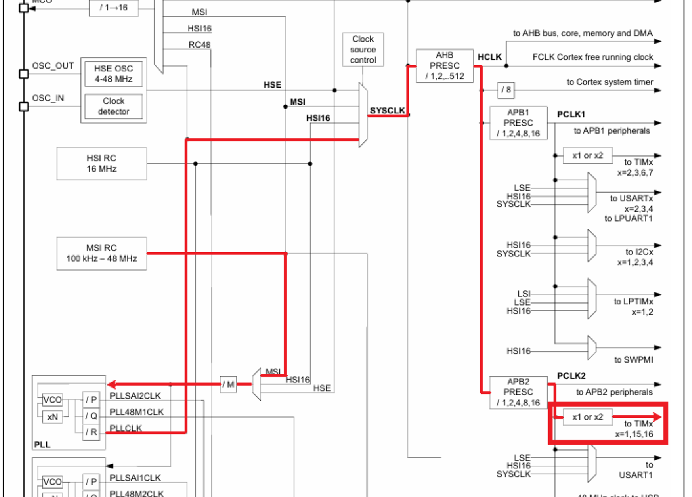
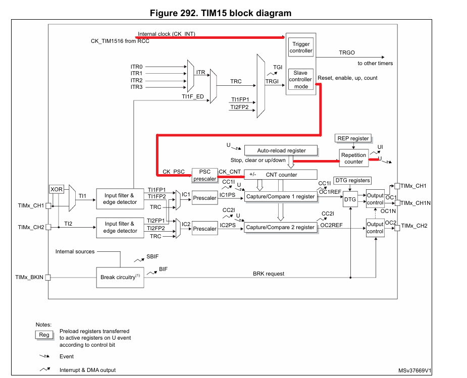
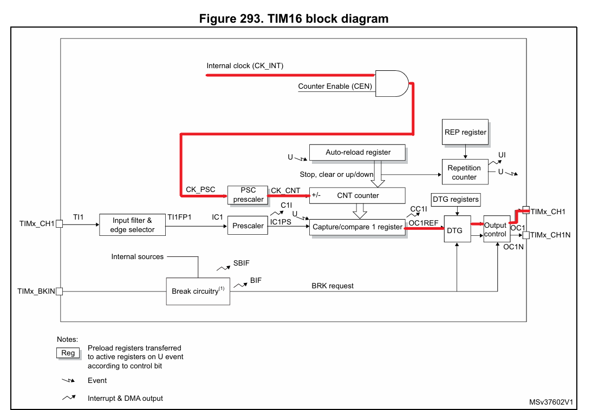
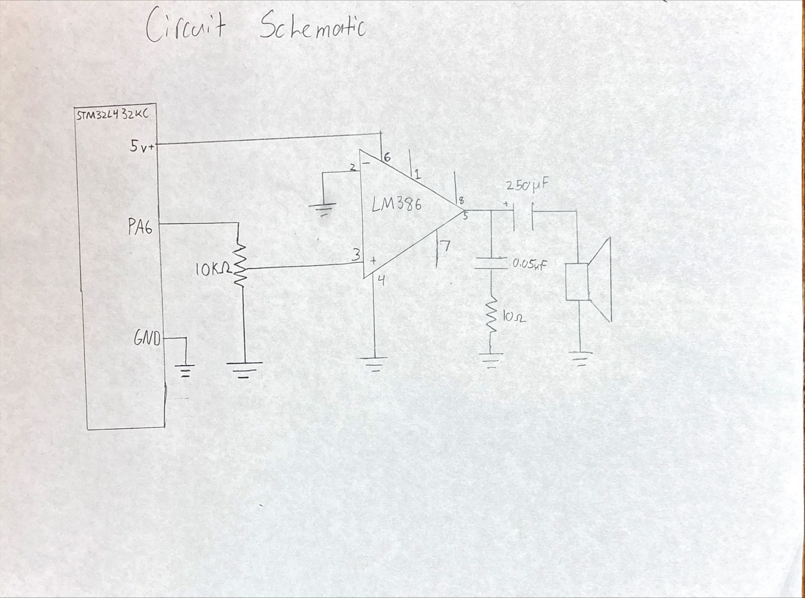
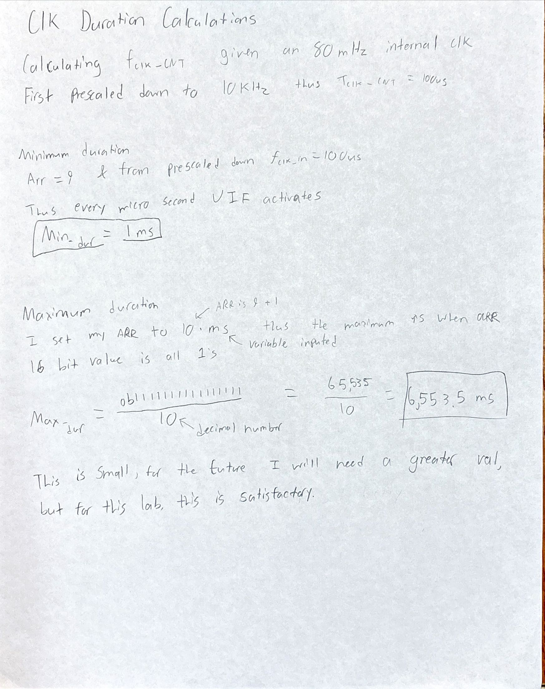
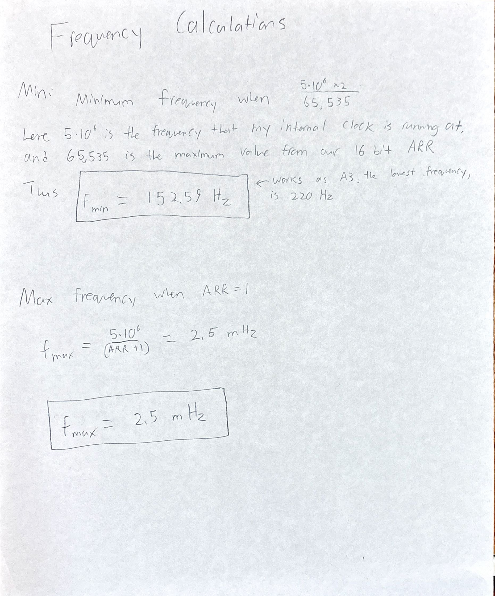
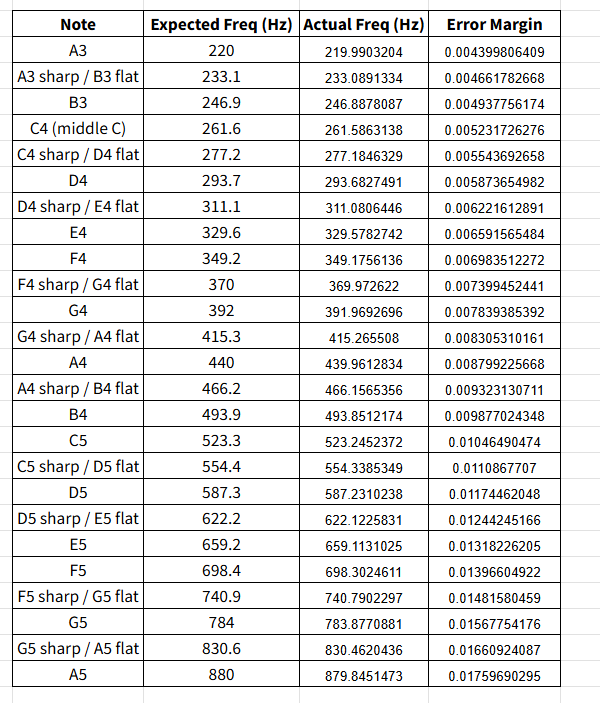

## Hours Spent:
24

## Introduction:

This lab required the use of an MCU programmed in order to play music by using timers to generate square waves by toggling a GPIO pin at a specific frequency for specified durations.

This required the use of internal clock timers specifically activating timers 15 and 16. To enable these timers, the clock tree was vital for understanding the pathing. First MSI RC needed to be fed into the PLL which then could be outputted into SYSCLK which would require the use of AHB prescalers (HCLK). Lastly HCLK would go into APB2 prescalers PCLK2 which could then go to TIM15 and TIM16. The AHB prescalers brought the 80MHz clock signal down to 10 MHz, and then down to 5 MHz via the APB2 prescalers. 

To configure clk TIM15 as the clock that handled delay required the use of the internal clock from RCC, which is running at 5 MHz which first needed to go into PSC prescalers. At the same time, the Auto-reload register was required to update the clk and reload when overflowed. From there the output was set into the repetition counter which handled our delay.

To configure the clk TIM16 as the PWM required a bit more work. As the book notes, The PWM mode can be selected independently on each channel (one PWM per OCx output) by writing ‘110’ (PWM mode 1) or ‘111’ (PWM mode 2) in the OCxM bits in the TIMx_CCMRx register. You must enable the corresponding preload register by setting the OCxPE bit in the TIMx_CCMRx register, and eventually the auto-reload preload register (in upcounting or center-aligned modes) by setting the ARPE bit in the TIMx_CR1 register. OCx polarity is software programmable using the CCxP bit in the TIMx_CCER register. It can be programmed as active high or active low. OCx output is enabled by a combination of the CCxE, CCxNE, MOE, OSSI and OSSR bits (TIMx_CCER and TIMx_BDTR registers). Refer to the TIMx_CCER register description for more details.

The use of two timers was essential as one handled the duration of a signal while the other handled the frequency. The clock handling frequency required to be configured in PWM mode. Thus the GPIO, a new part of the GPIO driver, which I chose port 6, would need to be redefined to be able to handle this. 

## Block Diagram:
There is no block diagram for this Lab

## Schematic:

Figure _ illustrates a the schematic of the system where an audio opAmp LM386  is powered via the STM32L432KC board at 5 volts. Here the board also controls the input into the 10 kohm potentiometer. Outputing from chanel 5 the signal then goes through a 250 uF capacitor and out to a speaker.   

### Calculations:

## Results:

The implementation works, the song Fur Elise plays at a reasonable frequency and speed. It does not sound rushed and you can even alternate the volume via the potentiometer. I also added my own song which sings happy birthday. I am very happy with the results of this and would like to see if it can play more difficult songs personally later on. For now I believe that this has qualified for Excellence. 

## AI Prototype:

For the AI prototype I asked Chat What timers should I use on the STM32L432KC to generate frequencies ranging from 220Hz to 1kHz? What’s the best choice of timer if I want to easily connect it to a GPIO pin? What formulae are relevant, and what registers need to be set to configure them properly?

Here is what it told me:
You want to generate audio-range square waves (220 Hz – 1 kHz), output them on a GPIO, and ideally do so with minimal software intervention.

1. Which timers should you use?

The STM32L432KC has several general-purpose timers:

TIM2, TIM5 → 32-bit, general-purpose.

TIM15, TIM16, TIM17 → 16-bit, advanced/general.

TIM1 → 16-bit advanced (PWM, complementary outputs, etc.).

TIM6, TIM7 → basic timers (no direct GPIO output).

👉 Best choice for your case:

Use TIM2 or TIM5 if you want flexibility (large prescaler range, direct output to GPIO, 32-bit counter avoids overflow).

Use TIM15–17 if you want smaller footprint, but 16-bit means tighter prescaler tuning.

Don’t use TIM6/7 unless you only need interrupts (they can’t drive GPIO).

Recommendation:
Pick TIM2 (available on all STM32L432 packages) and connect one of its output compare/PWM channels to a GPIO (via AF — Alternate Function mapping).

2. Timer frequency generation basics

Timers work as programmable frequency dividers:

Timer input clock
𝑓𝑇𝐼𝑀=𝑓𝐴𝑃𝐵𝑥×(multiplier if APB prescaler > 1)(𝑃𝑆𝐶+1)fTM = (PSC+1)fAPBx	​ ×(multiplier if APB prescaler > 1)

f_APBx is the peripheral bus clock (depends on clock tree config).

PSC is the prescaler register (TIMx_PSC).

Timer period (auto-reload register, ARR)

The counter runs from 0 → ARR. Then it resets and repeats.

𝑓𝑂𝑈𝑇=𝑓𝑇𝐼𝑀(𝐴𝑅𝑅+1)fOUT = (ARR+1)fTIM

If you use toggle output compare mode (OCxM = toggle), you get a square wave, so the actual output frequency is:

𝑓𝑆𝑄=𝑓𝑂𝑈𝑇2=𝑓𝑇𝐼𝑀2⋅(𝐴𝑅𝑅+1)fSQ = 2fOUT = 2⋅(ARR+1)fTIM
	​

3. Example calculation

Say your f_APB1 = 80 MHz (common for STM32L4, TIM2 is on APB1).

Choose prescaler PSC = 79 → timer tick = 80 MHz / 80 = 1 MHz (1 µs per tick).

Now to generate 220 Hz:

𝐴𝑅𝑅=𝑓𝑇𝐼𝑀2𝑓𝑆𝑄−1=1,000,0002⋅220−1≈2272

ARR=2f
SQfTIM−1=2⋅2201,000,000

−1≈2272

For 1 kHz:

𝐴𝑅𝑅=1,000,0002⋅1000−1=499
ARR=
2⋅1000
1,000,000
	​

−1=499

Both values fit in 16 bits — so either TIM2 (32-bit) or a 16-bit timer will work.

4. Relevant registers

For toggle output on GPIO using TIM2:

Enable TIM2 clock

RCC->APB1ENR1 |= RCC_APB1ENR1_TIM2EN;

Configure prescaler (PSC) & auto-reload (ARR):

TIM2->PSC = 79;     // Prescaler → 1 MHz timer clock
TIM2->ARR = ARR;    // Auto-reload for frequency

Set Output Compare channel in Toggle mode:
Example with Channel 1:

TIM2->CCMR1 &= ~TIM_CCMR1_OC1M;
TIM2->CCMR1 |= (0b011 << TIM_CCMR1_OC1M_Pos);  // Toggle on match
TIM2->CCER  |= TIM_CCER_CC1E;                  // Enable output on CH1
TIM2->CCR1   = 0;                              // Initial compare value

Route TIM2_CH1 to a GPIO pin (Alternate Function):
For instance, PA0 can be TIM2_CH1 (AF1).

GPIOA->MODER &= ~(0b11 << (0*2));
GPIOA->MODER |=  (0b10 << (0*2));   // Alternate function
GPIOA->AFR[0] |= (0b0001 << (0*4)); // AF1 = TIM2_CH1

Enable timer counter:

TIM2->CR1 |= TIM_CR1_CEN;

Now PA0 outputs a square wave at your programmed frequency.

5. Summary

Best timer for GPIO frequency generation: TIM2 (32-bit, flexible, direct AF mapping).

Key formulae:

Timer tick: 
𝑓𝑇𝐼𝑀=𝑓𝐴𝑃𝐵𝑥/(𝑃𝑆𝐶+1)fTIM	=fAPBx/(PSC+1)

Update rate: 
𝑓𝑈𝑃𝐷=𝑓𝑇𝐼𝑀/(𝐴𝑅𝑅+1)fUPD =fTIM/(ARR+1)

Square wave output (toggle mode): 
𝑓𝑆𝑄=𝑓𝑈𝑃𝐷/2fSQ =fUPD/2

Registers to configure: TIMx_PSC, TIMx_ARR, TIMx_CCRy, TIMx_CCMRy, TIMx_CCER, TIMx_CR1, and the corresponding GPIO MODER/AFR.

Would you like me to also show you a full minimal C example (using direct register writes) that generates, say, 440 Hz on a pin — so you can adapt it to 220–1kHz easily?

This is super cool because it actually gave me examples and equations for how to use it. I think this did a great job at answering my question and looking through the data sheet I belive that what it gave me is actually correct. This would have been useful when working on this project actually. 