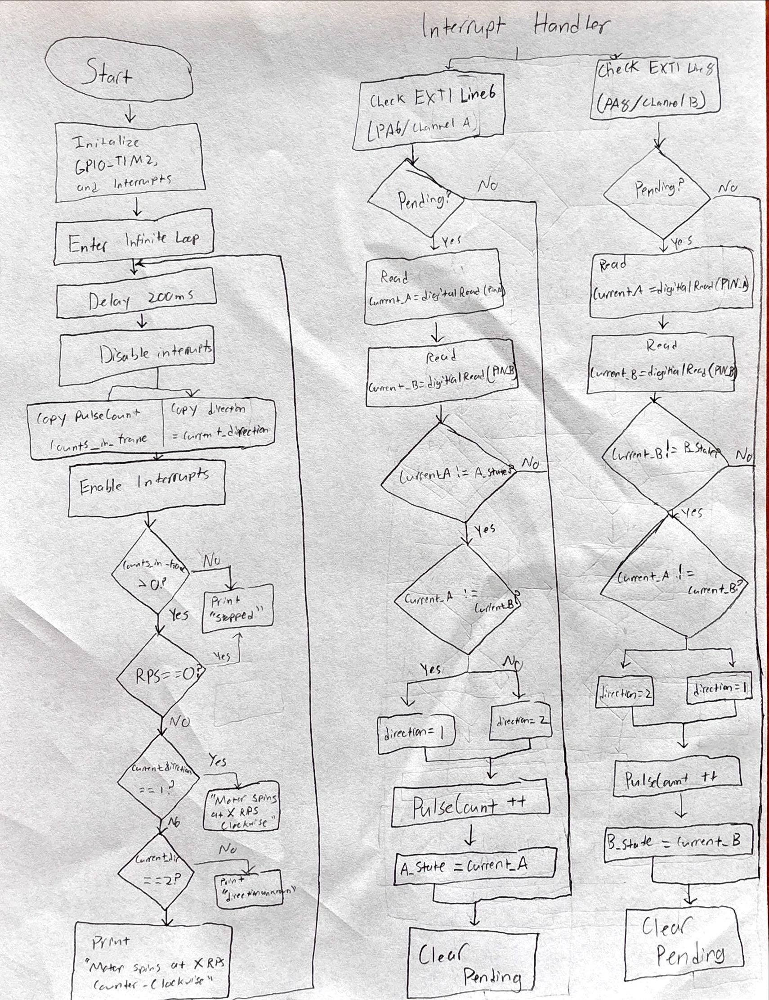
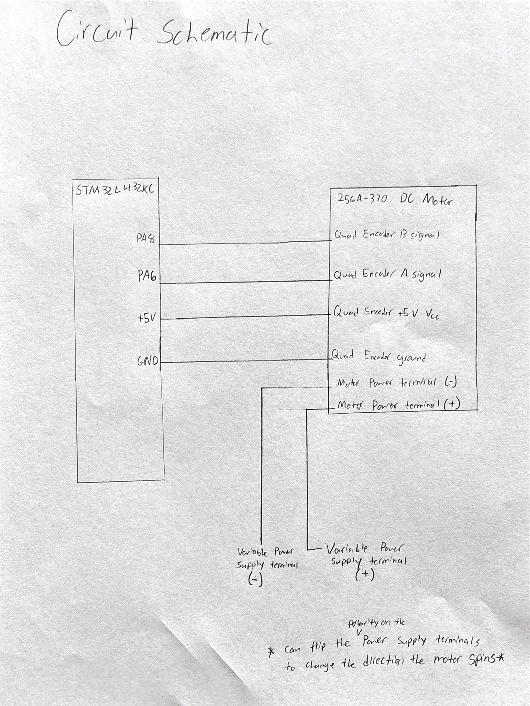

## Hours Spent:
7

## Introduction:

This lab required the use of an MCU programmed to determine the speed of a motor via reading a quiadrture encoder using interrupts. To do this required the configuring of the MCU's External Interrupt (EXTI) system to monitor the encoder's Channel A (PA6) and Channel B (PA8) outputs, enabling both rising and falling edge detection on both signals to achieve maximum 4x counting resolution. The Interrupt Service Routine (ISR) was responsible for rapidly incrementing a counter variable and decoding the motor's direction based on the phase relationship between the two signals at the moment of the edge.

## FLow Chart:

This is my flowchart of the system

## Schematic:

Figure 2 illustrates a the schematic of the system where my STM32L432KC MCU is interfacing with a 25GA-370 DC Motor using ports that can support 5 volts PA8 & PA6. 

### Calculations:

## Results:

The implementation works, the MCU is able to ditect the motor spinning and calcuate it's RPM. Depending on the polarity of the system the MCU can also tell you if the motor is spinning clockwise or counter-clockwise. 

## AI Prototype:

For the AI Prototype, I asked ChatGPT if it could write me interrupt handlers to interface with a quadrature encoder. I’m using the STM32L432KC, what pins should I connect the encoder to in order to allow it to easily trigger the interrupts?

Here Chat told me that first, the STM32L432KC is great for decoding quadrature encoders because its TIM2, TIM3, and TIM4 peripherals can operate in encoder interface mode, saving you from manually writing interrupt-based decoders.

However, if you specifically want to use external interrupts (EXTI) to handle the encoder signals in software (rather than using the built-in encoder mode), let’s go over both options.

It gave me multiple options on how to do this, first via Use Hardware Encoder Mode (No Manual ISRs Needed).

#include "stm32l4xx_hal.h"

TIM_HandleTypeDef htim2;

void Encoder_Init(void) {
    __HAL_RCC_TIM2_CLK_ENABLE();
    __HAL_RCC_GPIOA_CLK_ENABLE();

    GPIO_InitTypeDef GPIO_InitStruct = {0};

    // Configure PA0, PA1 as TIM2 CH1/CH2 in alternate function
    GPIO_InitStruct.Pin = GPIO_PIN_0 | GPIO_PIN_1;
    GPIO_InitStruct.Mode = GPIO_MODE_AF_PP;
    GPIO_InitStruct.Pull = GPIO_NOPULL;
    GPIO_InitStruct.Speed = GPIO_SPEED_FREQ_HIGH;
    GPIO_InitStruct.Alternate = GPIO_AF1_TIM2;
    HAL_GPIO_Init(GPIOA, &GPIO_InitStruct);

    // Configure TIM2 in encoder interface mode
    htim2.Instance = TIM2;
    htim2.Init.Prescaler = 0;
    htim2.Init.CounterMode = TIM_COUNTERMODE_UP;
    htim2.Init.Period = 0xFFFFFFFF;
    htim2.Init.ClockDivision = TIM_CLOCKDIVISION_DIV1;

    TIM_Encoder_InitTypeDef encoderConfig = {0};
    encoderConfig.EncoderMode = TIM_ENCODERMODE_TI12;

    encoderConfig.IC1Polarity = TIM_INPUTCHANNELPOLARITY_RISING;
    encoderConfig.IC1Selection = TIM_ICSELECTION_DIRECTTI;
    encoderConfig.IC1Prescaler = TIM_ICPSC_DIV1;
    encoderConfig.IC1Filter = 2;

    encoderConfig.IC2Polarity = TIM_INPUTCHANNELPOLARITY_RISING;
    encoderConfig.IC2Selection = TIM_ICSELECTION_DIRECTTI;
    encoderConfig.IC2Prescaler = TIM_ICPSC_DIV1;
    encoderConfig.IC2Filter = 2;

    HAL_TIM_Encoder_Init(&htim2, &encoderConfig);
    HAL_TIM_Encoder_Start(&htim2, TIM_CHANNEL_ALL);
}

// Read encoder position:
int32_t Encoder_GetCount(void) {
    return (int32_t)__HAL_TIM_GET_COUNTER(&htim2);
}

This is super cool that it gave me pins, however, looking at the data sheet, these pins are not safe for up to 5 volts. So while this code does look correct, and may even properly initialize the pins I would not trust it on my board as it may break it. 

