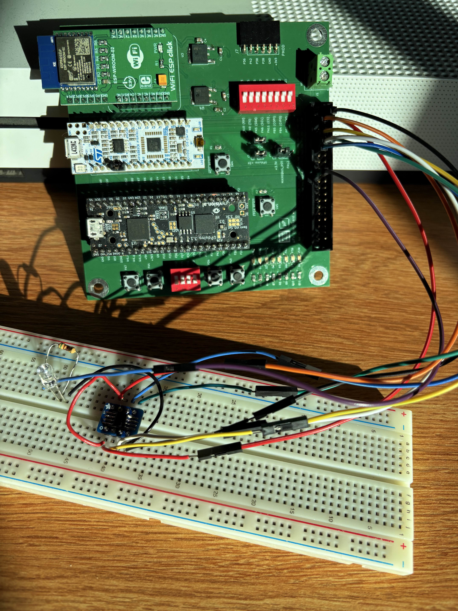
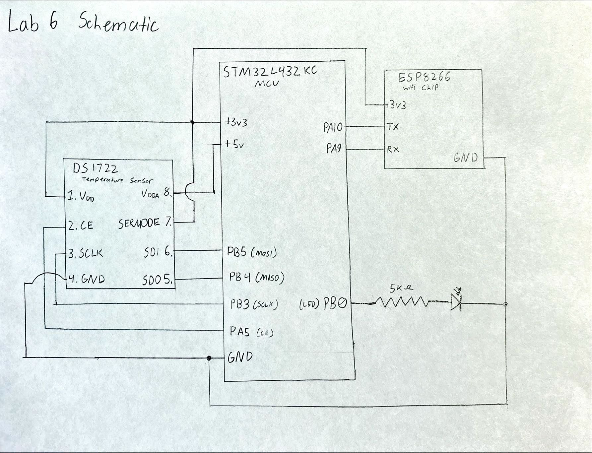
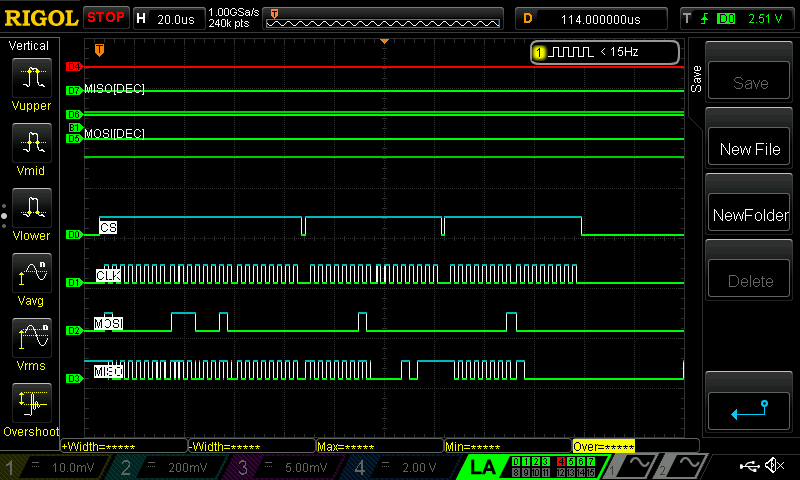
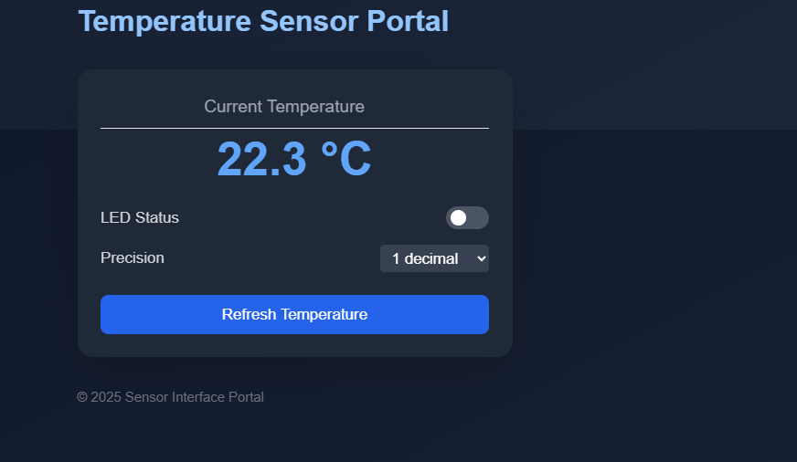

## Hours Spent:
21

## Introduction:

Lab 6 required building an internet-accessible device capable of measuring ambient temperature, using a DS1722 temperature sensor, as well as controlling an onboard LED. To accomplish this, the MCU had to program SPI peripherals in order to push, send, and view currenture temperature readings onto the website. Furthermore, an ESP8255 wifi chip was utilized in order to access the website. To implement SPI required a function to initialize SPI communication, which needed a baud rate, clock phase & polarity. Here the baud rate was set to 0b111 in order for the SPI clock to run slower than the clock for the temperature sensor, allowing for SPI to properly retrieve temperature data. Here the packet size was configured to 8 bits allowing for easy alignment with the outputs of the temperature sensor. Furthermore, PA5 was defined to control the chip enable, which manually toggled for each SPI read and write operation. For the otherSPI peripherals port PB3 controlled the SPI clock, port PB4 controlled the MISO, and port PB5 controlled the MOSI. Lastly, port PB0 controlled the LED which could be turned on and off via buttons on the website. 



## Using the Temperature Sensor: 
Communicating with the temperature sensor requires a defined write address, which is 0x80, followed by reading from the least significant bit (LSB) then the most significant bit (MSB). To read the LSB required to call read address 0x01 and to read from the MSB required to call read address address 0x02. To print the temperature required to isolate the sign bit in the MSB then the other values would be used to determine the specific integer value of the temperature. Lastly, depending on the sign bit (positive or negative) would require either adding or subtracting the corresponding resolution bits. 

## Schematic:


Figure 3 illustrates how SPI interacts with the temperature sensor through the communcation of wires between the MCU and the DS1722. This circuit also illustrates how the LED works and communcaiton between the wifi chip and MCU.  


## Logic Analyzer Testing and Debugging:
Debugging was conducted using both the SEGGER debugger and a logic analyzer. This method proved effective in confirming that the temperature conversion algorithm produced the expected results.The logic analyzer was utilized to monitor SPI communication signals. By decoding the MISO and MOSI lines, the transmitted and received data values could be directly interpreted, simplifying the analysis of SPI transactions. During this process, an error was identified: the initial Baud Rate was incorrect (originally set as 8 instead of 7) which caused reading issues between the MCU and the temperature chip. Further investigation revealed that the issue was caused by errors in the initial wiring as the MISO line and MOSI line were accidentally swapped. 
A representative SPI transaction captured by the logic analyzer is shown below.



## Results:

The implementation works, the MCU and temeprature sensor correctly talk to eachother via SPI communcaiton and can properly read and display the temperature on a website. Furthermore, the different bit configurations also work as a user can toggle between 8 to 12 bit configuration. Lastly the LED can be controled via the buttons on the website. 

## AI Prototype:
For the AI prototype I tasked Chat GPT to create a HTML page that looks good and is intuitive to show the temperature, control an LED, and change the precision of the readout. Almost instaly Chat responded and created "a clean, modern, and intuitive HTML+CSS+JS page for your temperature sensor portal." Here it gave me some notes before sharing the code with me. Firstly it uses an auto-updating from a fake example sensor API. Next it has an LED control switch which one can toggle on/off. I would share the code, but it seems to break my website when I paste it in. Crazy enough the code actually works and changes my white background to a blue and inserts this crazy temperature UI that actually detects the temperature of my room (I am so suprised this actually works). Here is a picture of it breaking my website: 



Next I asked Chat if it could write me a C function to carry out a SPI transaction to retrieve a temperature reading from a DS1722 sensor. Make use of CMSIS libraries for the STM32L432KC. Here it gave me some backgorund info on the DS1772 where "the DS1722 is a digital thermometer that communicates via SPI, supporting continuous or one-shot temperature conversions. On the STM32L432KC, you can use CMSIS-style register access (not HAL) to keep things lean and fast." Here is the code that it gave me:

```{.c}
#include "stm32l432xx.h"

#define DS1722_CS_LOW()   (GPIOA->BSRR = (1 << (4 + 16))) // Assuming PA4 = CS
#define DS1722_CS_HIGH()  (GPIOA->BSRR = (1 << 4))

static uint8_t SPI1_TransmitReceive(uint8_t data);

float DS1722_ReadTemperature(void) {
    uint8_t msb, lsb;
    uint16_t raw;
    float temperature;

    DS1722_CS_LOW();
    SPI1_TransmitReceive(0x82);
    msb = SPI1_TransmitReceive(0x00);
    SPI1_TransmitReceive(0x83);
    lsb = SPI1_TransmitReceive(0x00);
    DS1722_CS_HIGH();

    raw = ((uint16_t)msb << 8) | lsb;
    raw >>= 4;
    if (raw & 0x800) raw |= 0xF000;
    temperature = (float)((int16_t)raw) * 0.0625f;
    return temperature;
}

static uint8_t SPI1_TransmitReceive(uint8_t data) {
    while (!(SPI1->SR & SPI_SR_TXE));
    *((__IO uint8_t *)&SPI1->DR) = data;
    while (!(SPI1->SR & SPI_SR_RXNE));
    return *((__IO uint8_t *)&SPI1->DR);
}
```

When I tried this code, it did not display correctly, which is kind of upsetting. It seems to me that it may have gotten the parts where it is transmitting using SPI incorrectly. Skimming over the code I see that the unit16_t variable "raw" may not be shifting to the correct spot. Which means it is not reading the data sheet correctly. But this is really helpful with getting started. 